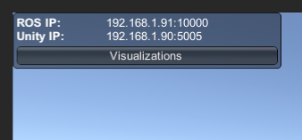
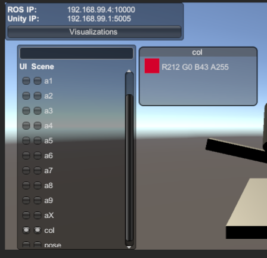
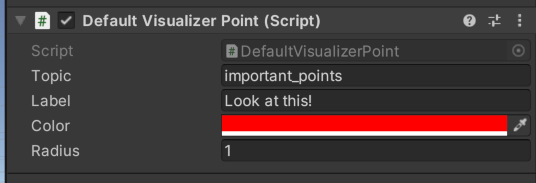
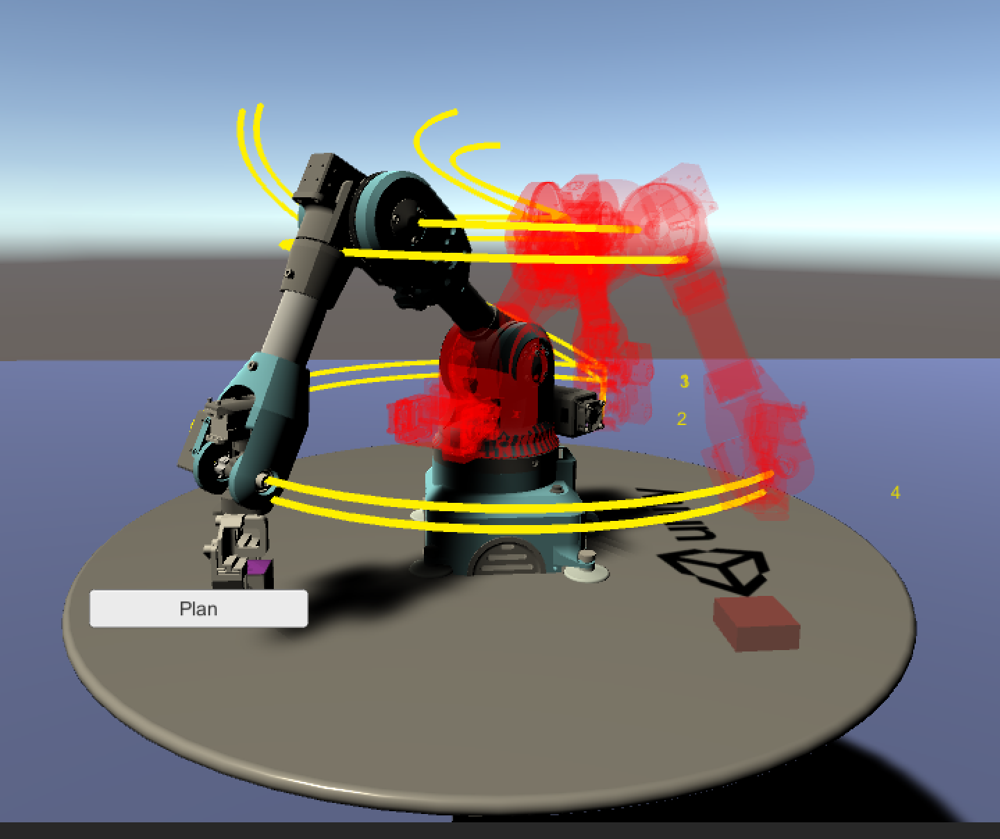

# Message Visualization component

To get started with visualizations, click the Visualizations button on the ROSConnection HUD.



(The HUD should appear in the top left corner of the Game window as long as you're in Play mode and a ROSConnection is active. If you don't see it, ensure "Show HUD" is ticked in your Robotics/ROS Settings window.)

When you click the Visualizations button, it opens a list of all ROS topics on which Unity has sent or received a message in the current session. Click any topic to open a window showing the last message sent or received on that topic.



You can move these windows around by dragging their title bar, or resize them by dragging the corners. The window layout is saved between sessions. (If you need it, the layout is saved to the file RosHudLayout.json, in the Unity [Persistent Data Path](https://docs.unity3d.com/ScriptReference/Application-persistentDataPath.html).)

By default, these windows' contents are pretty basic - it just calls Message.ToString() to display all the message's fields. To improve how the HUD displays a message, like the screenshot above which shows the actual color represented by a ColorRGB message, you can add a Visualization Suite to your scene, and/or create your own *custom visualizations*.

# Configuring your visualization suite

A visualization suite is simply a collection of message visualizer components, placed in your scene, that control how messages are displayed in that scene. (If you need to share your visualizers between multiple scenes, consider creating a prefab.)

To get started, try out the default visualization suite: find the `DefaultVisualizationSuite` prefab in the com.unity.robotics.message-visualizations package (i.e. this package) and drag it into your scene. This provides an assortment of visualizations for many of the common ROS message types.

To make your own visualization suite, you can create a new GameObject in your scene, call it "VisualizationSuite" (or whatever you want) and add any number of visualizer components to it. The predefined visualizers should be easy to find: they're all named DefaultVisualizer*MessageType* - for example, `DefaultVisualizerVector3`. Each visualizer can be set up to apply only to messages on a specific topic (just set the "topic" field - or leave it blank to apply to all messages of the appropriate type). Visualizers can also have their own custom color and label, along with any other parameters that specific visualizer has.

So, for example, let's assume you want to call out Point messages on the "important_points" topic, and you'd like them to appear extra large and in red. So maybe you'd add a DefaultVisualizerPoint script to your suite, and set it to draw large red points.



(Note that in Unity, "radius" is in Unity coordinates, so a radius of 1 means the points have a radius of 1 meter.)

# Example: adding visualizers to the Pick & Place tutorial

To get you started with visualizers - assuming you have completed at least part 3 of the [Pick & Place tutorial](https://github.com/Unity-Technologies/Unity-Robotics-Hub/blob/main/tutorials/pick_and_place/README.md), let's add visualizations to it.

1. Open your Pick and Place project.

1. To import the message-visualizations package: open Window/Package Manager, click on the plus button and select "Add package from Git URL". Paste in the following text: https://github.com/Unity-Technologies/ROS-TCP-Connector.git?path=/com.unity.robotics.message-visualizations#laurie/CustomGUILayout

1. (For now, you also need to do the same with https://github.com/Unity-Technologies/ROS-TCP-Connector.git?path=/com.unity.robotics.ros-tcp-connector#laurie/CustomGUILayout)

1. Here's an example visualizer for the MoverServiceResponse message used in part 3 of the Pick and Place tutorial. Create a script called PickAndPlaceVisualizerExample.cs, and paste the following code into it. (Alternatively, you can copy the file from the folder Examples~ next to the document you're reading.).

```
using RosMessageTypes.Moveit;
using RosMessageTypes.NiryoMoveit;
using RosSharp.Urdf;
using Unity.Robotics.MessageVisualizers;
using UnityEngine;

public class PickAndPlaceVisualizerExample : BasicVisualizer<MMoverServiceResponse>
{
    public Color ghostColor;
    public float thickness = 0.01f;
    public float labelSpacing = 0.1f;
    public UrdfRobot forRobot;
    RobotVisualization robotVisualization;

    public override void Start()
    {
        base.Start();
        robotVisualization = new RobotVisualization(forRobot);
    }

    public override void Draw(DebugDraw.Drawing drawing, MMoverServiceResponse message, MessageMetadata meta, Color color, string label)
    {
        int Idx = 1;
        foreach(MRobotTrajectory trajectory in message.trajectories)
        {
            RobotVisualization.JointPlacement[][] jointPlacements = robotVisualization.GetJointPlacements(trajectory.joint_trajectory);
            RobotVisualization.JointPlacement[] finalPose = jointPlacements[jointPlacements.Length - 1];

            robotVisualization.DrawJointPaths(drawing, jointPlacements, color, thickness);
            robotVisualization.DrawGhost(drawing, finalPose, ghostColor);

            drawing.DrawLabel(Idx.ToString(), finalPose[finalPose.Length - 1].Position, color, labelSpacing);
            ++Idx;
        }
    }
}
```

1. Create a new GameObject in your scene called "VisualizationSuite", and attach the PickAndPlaceVisualizerExample script to it. Drag the niryo_one gameobject into its forRobot field, and select some nice colors for its color fields. (For the Ghost Color, try using an Alpha of 40 to make it nicely transparent.)

1. Enter Play mode and open the Visualizations menu: you should find a topic named "niryo_moveit". Click on it to open a window for that topic.

1. Now, when you press the button to make your robot move, you should see ghost copies of the robot showing where it will end up after each trajectory, plus lines showing the path each joint will take.



# Writing a basic visualizer

Although the message visualization system includes default visualizers for many common message types, no doubt you have your own unique messages you want to visualize, or you'll want to change how a message is displayed for your project's specific needs. The simplest way to create a new visualizer is to write a MonoBehaviour script that inherits from BasicVisualizer. Here's a simple example:

	using System.Collections;
	using System.Collections.Generic;
	using Unity.Robotics.MessageVisualizers;
	using Unity.Robotics.ROSTCPConnector.MessageGeneration;
	using Unity.Robotics.ROSTCPConnector.ROSGeometry;
	using UnityEngine;
	using MPoint = RosMessageTypes.Geometry.Point;
	
	public class PointVisualizerExample : BasicVisualizer<MPoint>
	{
		public float size = 0.1f; // this will appear as a configurable parameter in the Unity editor.
		
		public override void Draw(MPoint msg, MessageMetadata meta, Color color, string label,
				DebugDraw.Drawing drawing)
		{
			// The MessageVisualizations class provides convenient exension methods
			// for drawing many common message types.
            msg.Draw<FLU>(drawing, color, size);
			// Or you can directly use the drawing functions provided by the Drawing class
            drawing.DrawLabel(label, message.From<FLU>(), color, size);
		}

		public override System.Action CreateGUI(MPoint msg, MessageMetadata meta, DebugDraw.Drawing drawing)
		{
			// if you want to do any preprocessing or declare any state variables for the GUI to use,
			// you can do that here.
			string text = $"[{message.x}, {message.y}, {message.z}]";
			
			return () =>
			{
				// within the body of this function, it acts like a normal Unity OnGUI function.
                GUILayout.Label(text);
			};
		}
	}


- When the HUD needs to display the graphics for your message, it will call your Draw() function, providing all the information you need about what drawing to create. The last parameter, `drawing`, is a convenient drawing class you can use to draw text, 3d lines, points, and other geometric shapes. Your Draw function should call whatever functions you want to use on this drawing. The BasicVisualizer class automatically provides a suitable color and label for your drawing, but you don't have to use them if you don't want to.
- When the HUD needs to display the GUI for your message, it will call CreateGUI on your class. CreateGUI should return a function that behaves like a normal Unity OnGUI callback: in other words, it will be invoked once per UI event, for as long as your visualizer is active, and any GUI elements you draw in this function will appear in the HUD. Note this is a runtime GUI, not an editor GUI, so the GUI functions you call should come from GUI or GUILayout, not EditorGUILayout.
- Note, your drawing also gets passed into the CreateGUI function. You can use it to clear and redraw the drawing if you want (for example, maybe your gui provides buttons to turn parts of the drawing on and off, or resize an element).
- Note that, in principle, your visualizer class should be able to visualize more than one message at the same time. You should not store information about "the current message" in the Visualizer class itself, because there isn't just one current message. That kind of information can be stored as a local variable in your CreateGUI function.

# Writing a custom visualizer

If you need to create a visualization more complex than the simple DebugDraw class can support, you can write your own MonoBehaviour script that implements the IVisualizer interface.

	public interface IVisualizer
	{
		object CreateDrawing(Message msg, MessageMetadata meta);
		void DeleteDrawing(object drawing);
		Action CreateGUI(Message msg, MessageMetadata meta, object drawing);
	}

Here's a simple example of a visualizer that instantiates a prefab to mark the position and rotation of a Transform message:

	using UnityEngine;
	using Unity.Robotics.ROSTCPConnector.ROSGeometry;
	using Unity.Robotics.ROSTCPConnector.MessageGeneration;
	using MTransform = RosMessageTypes.Geometry.Transform;
	using Unity.Robotics.MessageVisualizers;

	public class PrefabTransformVisualizer : MonoBehaviour, IVisualizer
	{
		public string topic;
		public GameObject markerPrefab;

		public void Start()
		{
			// For a Visualizer to actually be known to the HUD,
			// it must call VisualizationRegister.RegisterVisualizer.
			// There are two versions: either register for messages on a specific topic,
			// or register for all messages of a specific type.
			// In this example, we choose between those two options based on whether
			// a topic has been specified.
			if (topic != "")
				VisualizationRegister.RegisterVisualizer(topic, this);
			else
				VisualizationRegister.RegisterVisualizer<MTransform>(this);
		}

		public object CreateDrawing(Message message, MessageMetadata meta)
		{
			// Note we have to cast from the generic Message class here.
			// BasicVisualizer would have done this for us.
			MTransform transformMessage = (MTransform)message;
			// instantiate a prefab and put it at the appropriate position and rotation.
			GameObject marker = Instantiate(markerPrefab);
			marker.transform.position = transformMessage.translation.From<FLU>();
			marker.transform.rotation = transformMessage.rotation.From<FLU>();
			return marker;
		}

		public void DeleteDrawing(object drawing)
		{
			// destroy the instance when we're done
			GameObject.Destroy((GameObject)drawing);
		}

		public System.Action CreateGUI(Message message, MessageMetadata meta, object drawing)
		{
			return () =>
			{
				// call the standard GUI function for displaying Transform messages
				((MTransform)message).GUI(meta.topic);
			};
		}
	}

- If your visualizer doesn't call VisualizationRegister.RegisterVisualizer, it won't get used.
- CreateDrawing will be called to display graphics for your message. You can do whatever you need to do in this function to display your visualization. The return value should be any value (a GameObject in this case, but it really can be anything - an index in a list, for example) that you can later use to identify the graphic you just made. If you return null, the system will assume you didn't need to display anything; DeleteDrawing will not get called later.
- DeleteDrawing will be called when it's time to clean up the visualization, passing the value you returned from CreateDrawing.
- CreateGUI is similar to the version described in the section above, except that its first argument is the base Message class instead of the subclass. The last argument is whatever object was returned by CreateDrawing.
- Note, unlike the BasicVisualizer class, creating a visualizer this way does not automatically select a color for your visualization. To use the same automatic color selection logic as BasicVisualizer, you can call `MessageVisualizations.PickColorForTopic(topic);`
